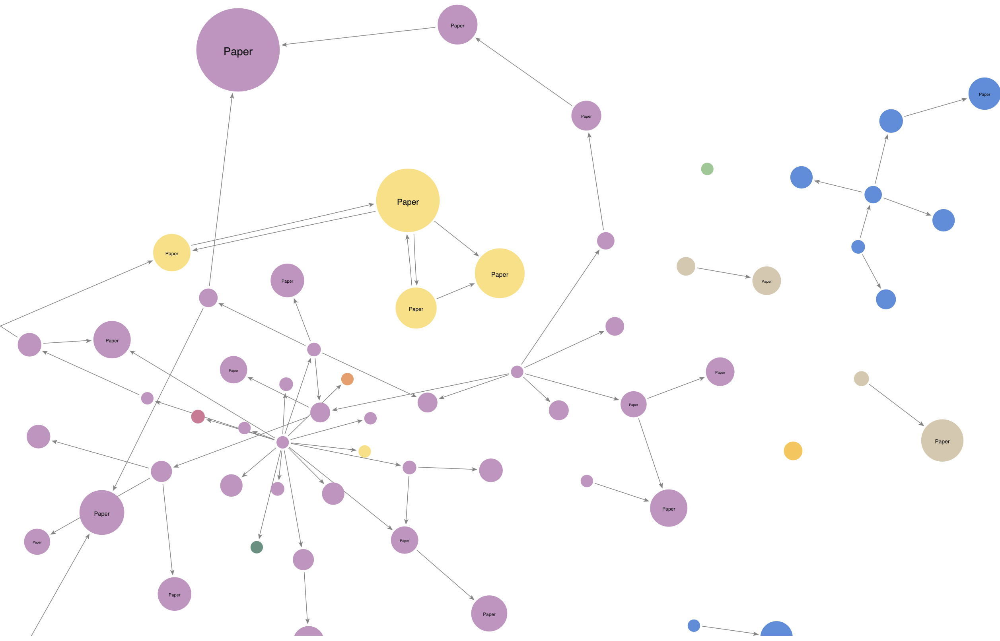

# Graph Visualization for Python by Neo4j

[](https://pypi.org/project/neo4j-viz/)
[](https://pypi.org/project/neo4j-viz/)

[](https://neo4j.com/docs/nvl-python/preview/)
[](https://discord.gg/neo4j)
[](https://community.neo4j.com)
[](https://pypi.org/project/neo4j-viz/)

`neo4j-viz` is a Python package for creating interactive graph visualizations based on data from Neo4j products.

The output is of type `IPython.display.HTML` and can be viewed directly in a Jupyter Notebook, Streamlit.
Alternatively, you can export the output to a file and view it in a web browser.

The package wraps the [Neo4j Visualization JavaScript library (NVL)](https://neo4j.com/docs/nvl/current/).

Proper documentation is forthcoming.

> [!WARNING]
> This package is still in development and the API is subject to change.




## Some notable features

* Easy to import graphs represented as:
  * projections in the Neo4j Graph Data Science (GDS) library
  * pandas DataFrames
* Node features:
  * Sizing
  * Colors
  * Captions
  * Pinning
* Relationship features:
  * Colors
  * Captions
* Graph features:
  * Zooming
  * Panning
  * Moving nodes
  * Using different layouts
* Additional convenience functionality for:
  * Resizing nodes, optionally including scale normalization
  * Coloring nodes based on a property
  * Toggle whether nodes should be pinned or not

Please note that this list is by no means exhaustive.


## Getting started


### Installation

Simply install with pip:

```sh
pip install neo4j-viz
```


### Basic usage

We will use a small toy graph representing the purchase history of a few people and products.

We start by instantiating the [Nodes](https://neo4j.com/docs/nvl-python/preview/api-reference/node.html) and
[Relationships](https://neo4j.com/docs/nvl-python/preview/api-reference/relationship.html) we want in our graph.
The only mandatory fields for a node are the "id", and "source" and "target" for a relationship.
But the other fields can optionally be used to customize the appearance of the nodes and relationships in the
visualization.

Lastly we create a
[VisualizationGraph](https://neo4j.com/docs/nvl-python/preview/api-reference/visualization-graph.html) object with the
nodes and relationships we created, and call its `render` method to display the graph.

```python
from neo4j_viz import Node, Relationship, VisualizationGraph

nodes = [
    Node(id=0, size=10, caption="Person"),
    Node(id=1, size=10, caption="Product"),
    Node(id=2, size=20, caption="Product"),
    Node(id=3, size=10, caption="Person"),
    Node(id=4, size=10, caption="Product"),
]
relationships = [
    Relationship(
        source=0,
        target=1,
        caption="BUYS",
    ),
    Relationship(
        source=0,
        target=2,
        caption="BUYS",
    ),
    Relationship(
        source=3,
        target=2,
        caption="BUYS",
    ),
]

VG = VisualizationGraph(nodes=nodes, relationships=relationships)

VG.render()
```

This will return a `IPython.display.HTML` object that can be rendered in a Jupyter Notebook or streamlit application.


### Examples

For some Jupyter Notebook and streamlit examples, checkout the [/examples](/examples)  directory.


## Contributing

If you would like to contribute to this project, please follow our [Contributor Guidelines](./CONTRIBUTING.md).
